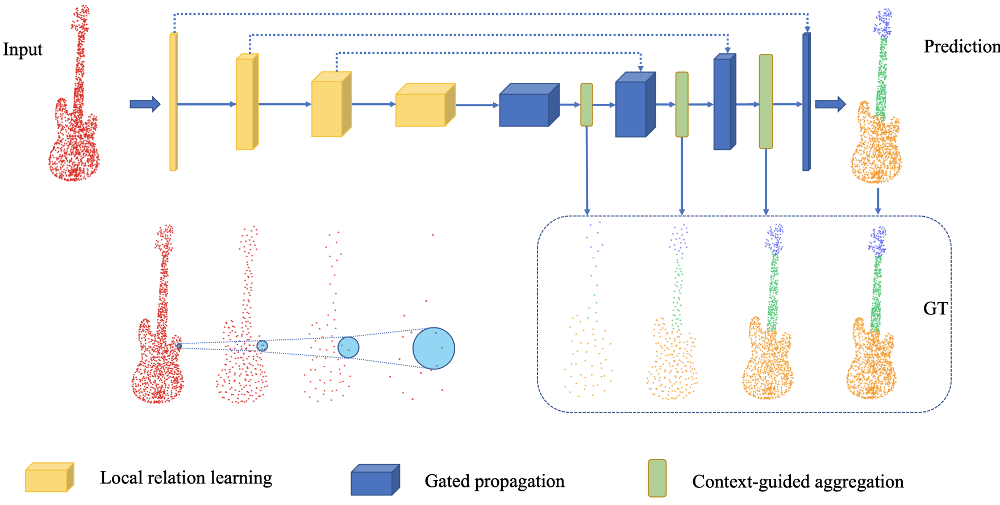
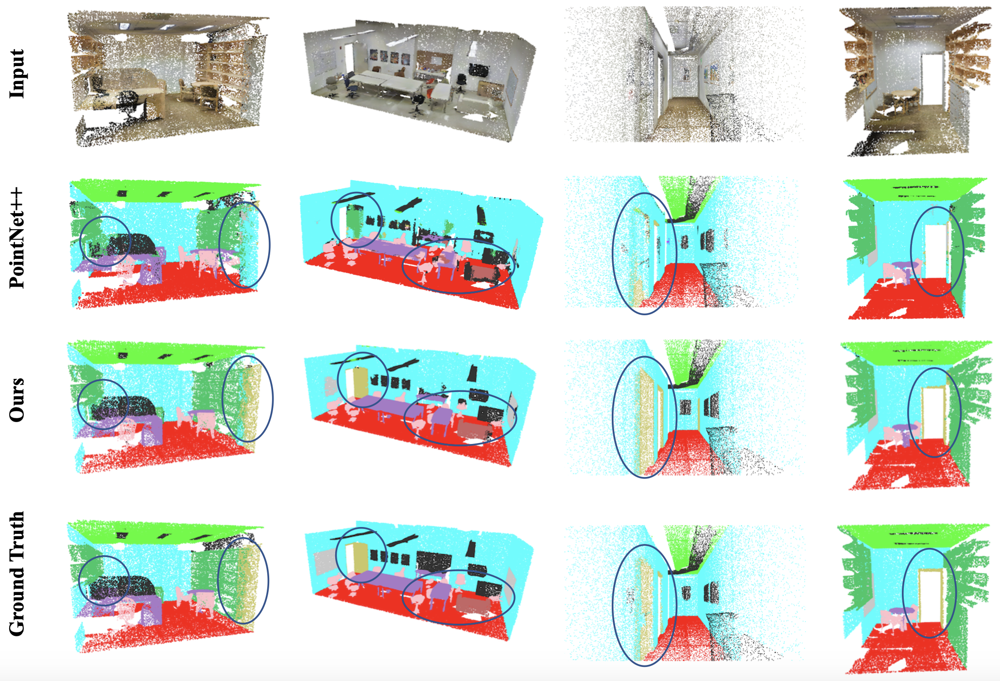

# Attention-based relation and context modeling for point cloud semantic segmentation (SMI 2020)
Zhiyu Hu, Dongbo Zhang, Shuai Li, Hong Qin

## Overview
<p align="center">  </p>

## Environment
Our method is tested in Python 2.7 and TensorFlow 1.4.0 on a workstation with an Intel Core i7-4790 CPU (3.60GHz, 16GB memory) and a GeForce GTX 1070 GPU (8GB memory, CUDA 8.0).

## Data
* Download [S3DIS Dataset](https://docs.google.com/forms/d/e/1FAIpQLScDimvNMCGhy_rmBA2gHfDu3naktRm6A8BPwAWWDv-Uhm6Shw/viewform?c=0&w=1). Version 1.2 (v1.2_Aligned_Version) of the dataset is used in this work.
``` bash
python collect_indoor3d_data.py
python gen_h5.py
cd data && python generate_input_list.py
cd ..
```

## Usage
* Create Conda Environment
``` bash
  conda create -n ARCM python=2.7
  source activate ARCM
```
* Clone the Repository
``` bash
git clone https://github.com/hu-zhiyu/ARCM && cd ARCM
```
* Install Required Dependencies
``` bash
pip install -r requirements.txt
```
* Compile TF Operators
``` bash
cd tf_ops
sh tf_compile_all.sh
```  
Make sure no errors generated at this step and refer to [PointNet++](https://github.com/charlesq34/pointnet2) when encountering any problems.
* Test with Pre-trained Model
``` bash
cd models/
python test.py --gpu 0 --log_dir log5_test --model_path log5/epoch_99.ckpt --input_list  meta/area5_data_label.txt --verbose
python eval_iou_accuracy.py
```

## S3DIS Area 5 Quantitative Results
| OA | mAcc | mIoU | ceiling | floor | wall | beam | column | window | door | table | chair | sofa | bookcase | board | clutter | 
| - | - | - | - | - | - | - | - | - | - | - | - | - | - | - | - |  
| 88.50 | 66.09 | 59.66 | 93.38 | 98.45 | 81.50 | 0.00 | 7.00 | 55.14 | 48.61 | 77.16 | 87.81 | 50.68 | 65.54 | 57.76 | 52.57 |

## S3DIS Visual Results
<p align="center">  </p>

## Acknowledgements
This code largely benefits from following repositories:
* [PointNet++](https://github.com/charlesq34/pointnet2)
* [ASIS](https://github.com/WXinlong/ASIS)